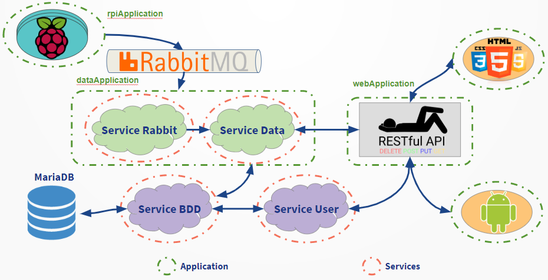

# Architecture

## Pré-requis

Pour pour tester et développer, il faut faut installer:
 
 * RabbitMQ Server
 * MariaDB
 * IntelliJ
 * JDK8
 
Pour plus d'informations concernant les installations, voir les fichiers dans la section Wiki

* Cahier des charges
* Lexique
* Setup
* Structure des données
* Tutoriels android

## Démarrer deploiement

Site web: http://193.48.57.164:8787/

Les applications ont été déployées sur la machine viturelle à l'adresse 193.48.57.164

dans le répertoire: ~/Sysco_deploy

Dans ce répertoire vous trouverez trois autres dossiers (WebApplication, RpiApplication, DataApplication) contenant les fichiers de déploiement: .jar, .jsp, .classe etc.

Afin de faciliter le lancement des trois application, nous avons mis en place des services permettant des les démarrer, arreter et redémarrer 
sans avoir à garder des terminaux ouverts:

* service   rpi-application   [start | restart | stop]
* service   data-application  [start | restart | stop]
* service    web-application   [start | restart | stop]

les fichiers init. correspondants se trouvent dans le répertoire: 

* /etc/init.d/rpi-application
* /etc/init.d/data-application
* /etc/init.d/web-application

## Construit avec

* [Spring Initializr](rhttps://start.spring.io) - The spring boot project generator
* [Maven](https://maven.apache.org/) - Dependency management
* [IntelliJ](https://rometools.github.io/rome/) - IDE
* [RabbitMQ](https://www.rabbitmq.com/) - Message broker
* [MariaDB](https://mariadb.org/) - Database

## Auteurs

* **CABRRAL Jorge**
* **FAHIM Hamza**
* **MOLLET Loïck**
* **SECK Malick**
